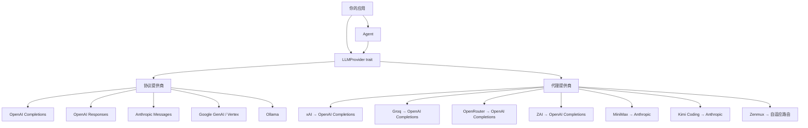

<div align="center">

# tiy-core

**统一 LLM API 与有状态 Agent 运行时 (Rust)**

[](https://opensource.org/licenses/MIT)
[](https://www.rust-lang.org/)
[](https://github.com/TiyAgents/tiy-core)

[English](./README.md) | [中文](./README-ZH.md)

</div>

---

tiy-core 是一个 Rust 库，提供统一的、与提供商无关的流式 LLM 补全接口，以及自主的 Agent 工具调用循环。只需编写一次应用逻辑，即可通过修改配置在 OpenAI、Anthropic、Google、Ollama 及 8+ 个其他提供商之间自由切换。

## 核心特性

- **一套接口，多个提供商** — 5 个协议级实现（OpenAI Completions、OpenAI Responses、Anthropic Messages、Google Generative AI / Vertex AI、Ollama）和 7 个代理提供商（xAI、Groq、OpenRouter、MiniMax、Kimi Coding、ZAI、Zenmux），统一在单一 `LLMProvider` trait 之下。
- **流式优先** — `EventStream<T, R>` 基于 `parking_lot::Mutex<VecDeque>` 实现 `futures::Stream`。每个提供商返回 `AssistantMessageEventStream`，包含细粒度的增量事件：文本、思维链、工具调用参数和完成事件。
- **工具 / 函数调用** — 通过 JSON Schema 定义工具，使用 `jsonschema` crate 验证参数，支持在 Agent 循环中并行或串行执行工具。
- **有状态 Agent 运行时** — `Agent` 管理完整对话循环：流式 LLM → 检测工具调用 → 执行工具 → 重新请求 → 循环。支持引导中断（steering）、后续消息队列、事件订阅（观察者模式）、中止操作，以及可配置的最大轮次（默认 25）。
- **扩展思维链** — 提供商特定的思维/推理支持，统一的 `ThinkingLevel` 枚举（Off → XHigh）。跨提供商的思维块转换在消息变换中自动处理。
- **默认线程安全** — 所有可变状态使用 `parking_lot` 锁和 `AtomicBool`，无中毒语义的并发设计。

## 架构



### 核心层

| 层 | 路径 | 职责 |
|---|---|---|
| **Types** | `src/types/` | 与提供商无关的数据模型：`Message`、`ContentBlock`、`Model`、`Tool`、`Context` |
| **Provider** | `src/provider/` | `LLMProvider` trait + 协议与代理实现 |
| **Stream** | `src/stream/` | 通用 `EventStream<T, R>`，实现 `futures::Stream` |
| **Agent** | `src/agent/` | 有状态对话管理器，含工具执行循环 |
| **Transform** | `src/transform/` | 跨提供商消息变换（思维块转换、工具调用 ID 规范化、孤儿工具调用处理） |
| **Thinking** | `src/thinking/` | `ThinkingLevel` 枚举及提供商特定的思维选项 |
| **Validation** | `src/validation/` | 工具参数 JSON Schema 验证 |
| **Models** | `src/models/` | `ModelRegistry`，内置预定义模型（GPT-4o、Claude Sonnet 4、Gemini 2.5 Flash 等） |

## 快速开始

在 `Cargo.toml` 中添加依赖：

```toml
[dependencies]
tiy-core = { git = "https://github.com/TiyAgents/tiy-core.git" }
tokio = { version = "1", features = ["full"] }
futures = "0.3"
```

### 流式补全

```rust
use std::sync::Arc;
use futures::StreamExt;
use tiy_core::{
    provider::{openai_completions::OpenAICompletionsProvider, get_provider, register_provider},
    types::*,
};

#[tokio::main]
async fn main() {
    // 注册提供商
    register_provider(Arc::new(OpenAICompletionsProvider::new()));

    // 构建模型
    let model = Model::builder()
        .id("gpt-4o-mini")
        .name("GPT-4o Mini")
        .provider(Provider::OpenAI)
        .context_window(128000)
        .max_tokens(16384)
        .build()
        .unwrap();

    // 创建包含消息的上下文
    let context = Context {
        system_prompt: Some("You are a helpful assistant.".to_string()),
        messages: vec![Message::User(UserMessage::text("法国的首都是什么？"))],
        tools: None,
    };

    // 从 model 解析提供商并流式获取响应
    let provider = get_provider(&model.provider).unwrap();
    let options = StreamOptions {
        api_key: Some(std::env::var("OPENAI_API_KEY").unwrap()),
        ..Default::default()
    };
    let mut stream = provider.stream(&model, &context, options);

    while let Some(event) = stream.next().await {
        match event {
            AssistantMessageEvent::TextDelta { delta, .. } => print!("{delta}"),
            AssistantMessageEvent::Done { message, .. } => {
                println!("\n--- 输入 {} tokens，输出 {} tokens ---",
                    message.usage.input, message.usage.output);
            }
            AssistantMessageEvent::Error { error, .. } => {
                eprintln!("错误: {:?}", error.error_message);
            }
            _ => {}
        }
    }
}
```

### Agent 工具调用

```rust
use std::sync::Arc;
use tiy_core::{
    agent::{Agent, AgentTool, AgentToolResult},
    provider::{openai_completions::OpenAICompletionsProvider, register_provider},
    types::*,
};

#[tokio::main]
async fn main() {
    register_provider(Arc::new(OpenAICompletionsProvider::new()));

    let agent = Agent::with_model(
        Model::builder()
            .id("gpt-4o-mini")
            .name("GPT-4o Mini")
            .provider(Provider::OpenAI)
            .context_window(128000)
            .max_tokens(16384)
            .build()
            .unwrap(),
    );

    agent.set_api_key(std::env::var("OPENAI_API_KEY").unwrap());
    agent.set_system_prompt("你是一个有工具访问权限的助手。");

    // 定义工具
    agent.set_tools(vec![AgentTool::new(
        "get_weather",
        "获取天气",
        "获取指定城市的当前天气",
        serde_json::json!({
            "type": "object",
            "properties": {
                "city": { "type": "string", "description": "城市名称" }
            },
            "required": ["city"]
        }),
    )]);

    // 注册工具执行器
    agent.set_tool_executor(|name, _id, args| async move {
        match name {
            "get_weather" => {
                let city = args["city"].as_str().unwrap_or("未知");
                AgentToolResult::text(format!("{city} 的天气：22°C，晴"))
            }
            _ => AgentToolResult::error(format!("未知工具: {name}")),
        }
    });

    // 订阅事件
    let _unsub = agent.subscribe(|event| {
        println!("事件: {event:?}");
    });

    // 执行提示 — Agent 自动循环：
    // LLM → 工具调用 → 执行 → 重新请求 → 直至完成
    let messages = agent
        .prompt(UserMessage::text("东京的天气怎么样？").into())
        .await
        .unwrap();

    println!("Agent 产生了 {} 条消息", messages.len());
}
```

## 支持的提供商

### 协议提供商（实现线路协议格式）

| 提供商 | API | 环境变量 | 默认 Base URL |
|---|---|---|---|
| OpenAI (Completions) | Chat Completions | `OPENAI_API_KEY` | `https://api.openai.com/v1` |
| OpenAI (Responses) | Responses API | `OPENAI_API_KEY` | `https://api.openai.com/v1` |
| Anthropic | Messages API | `ANTHROPIC_API_KEY` | `https://api.anthropic.com/v1` |
| Google | Generative AI + Vertex AI | `GOOGLE_API_KEY` | `https://generativelanguage.googleapis.com/v1beta` |
| Ollama | OpenAI 兼容 | — | `http://localhost:11434` |

### 代理提供商（注入 API Key + 兼容配置，委托给协议提供商）

| 提供商 | 委托目标 | 环境变量 |
|---|---|---|
| xAI | OpenAI Completions | `XAI_API_KEY` |
| Groq | OpenAI Completions | `GROQ_API_KEY` |
| OpenRouter | OpenAI Completions | `OPENROUTER_API_KEY` |
| ZAI | OpenAI Completions | `ZAI_API_KEY` |
| MiniMax | Anthropic Messages | `MINIMAX_API_KEY` |
| Kimi Coding | Anthropic Messages | `KIMI_API_KEY` |
| Zenmux | 自适应（见下方） | `ZENMUX_API_KEY` |

### Zenmux 自适应路由

Zenmux 根据模型 ID 自动路由到不同的协议提供商：

| 模型 ID 模式 | 路由协议 | Base URL |
|---|---|---|
| 包含 `google` 或 `gemini` | Google (Vertex AI) | `https://zenmux.ai/api/vertex-ai` |
| 包含 `openai` 或 `gpt` | OpenAI Responses | `https://zenmux.ai/api/v1` |
| 其他 | Anthropic Messages | `https://zenmux.ai/api/anthropic/v1` |

## API Key 解析优先级

Key 按以下优先级解析：

1. `StreamOptions.api_key`（逐请求覆盖）
2. 提供商的 `default_api_key()` 方法
3. 环境变量（如 `OPENAI_API_KEY`、`ANTHROPIC_API_KEY`）

Base URL 遵循相同模式：`StreamOptions.base_url` > `model.base_url` > 提供商的 `DEFAULT_BASE_URL`。

## 构建与测试

```bash
cargo build                          # 构建库
cargo test                           # 运行所有测试
cargo test test_agent_state_new      # 按名称运行单个测试
cargo test -- --nocapture            # 显示测试输出
cargo fmt                            # 格式化代码
cargo clippy                         # 代码检查

# 运行示例（需要 API Key）
cargo run --example basic_usage
cargo run --example agent_example
```

## 项目结构

```
src/
├── lib.rs              # Crate 根，公共 re-exports
├── types/              # 与提供商无关的数据模型
│   ├── model.rs        # Model, Provider, Api, Cost, OpenAICompletionsCompat
│   ├── message.rs      # Message (User/Assistant/ToolResult), StopReason
│   ├── content.rs      # ContentBlock (Text/Thinking/ToolCall/Image)
│   ├── context.rs      # Context, Tool, StreamOptions
│   ├── events.rs       # AssistantMessageEvent（流式事件）
│   └── usage.rs        # Token 用量追踪
├── provider/
│   ├── traits.rs       # LLMProvider trait
│   ├── registry.rs     # 全局 ProviderRegistry
│   ├── openai_completions.rs
│   ├── openai_responses.rs
│   ├── anthropic.rs
│   ├── google.rs       # 双模式：Generative AI + Vertex AI
│   ├── ollama.rs
│   ├── xai.rs          # 代理 → OpenAI Completions
│   ├── groq.rs         # 代理 → OpenAI Completions
│   ├── openrouter.rs   # 代理 → OpenAI Completions
│   ├── zai.rs          # 代理 → OpenAI Completions
│   ├── minimax.rs      # 代理 → Anthropic
│   ├── kimi_coding.rs  # 代理 → Anthropic
│   └── zenmux.rs       # 自适应三路路由
├── stream/
│   └── event_stream.rs # 通用 EventStream<T, R> + AssistantMessageEventStream
├── agent/
│   ├── agent.rs        # Agent 循环：流式 → 工具 → 重新请求
│   ├── state.rs        # 线程安全的 AgentState
│   └── types.rs        # AgentConfig, AgentEvent, AgentTool, ToolExecutionMode
├── transform/
│   ├── messages.rs     # 思维块转换、孤儿工具调用处理
│   └── tool_calls.rs   # 工具调用 ID 规范化
├── thinking/
│   └── config.rs       # ThinkingLevel, 提供商特定选项
├── validation/
│   └── tool_validation.rs # 工具参数 JSON Schema 验证
└── models/
    ├── mod.rs           # ModelRegistry + 全局预定义模型
    └── predefined.rs
```

## 许可证

[MIT](https://opensource.org/licenses/MIT)
