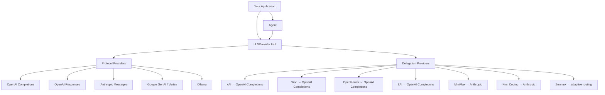

<div align="center">

# tiy-core

**Unified LLM API and stateful Agent runtime in Rust**

[](https://opensource.org/licenses/MIT)
[](https://www.rust-lang.org/)
[](https://github.com/TiyAgents/tiy-core)

[English](./README.md) | [中文](./README-ZH.md)

</div>

---

tiy-core is a Rust library that provides a single, provider-agnostic interface for streaming LLM completions and running agentic tool-use loops. Write your application logic once, then swap between OpenAI, Anthropic, Google, Ollama, and 8+ other providers by changing a config value.

## Highlights

- **One interface, many providers** — 5 protocol-level implementations (OpenAI Completions, OpenAI Responses, Anthropic Messages, Google Generative AI / Vertex AI, Ollama) and 7 delegation providers (xAI, Groq, OpenRouter, MiniMax, Kimi Coding, ZAI, Zenmux) behind a single `LLMProvider` trait.
- **Streaming-first** — `EventStream<T, R>` backed by `parking_lot::Mutex<VecDeque>` implements `futures::Stream`. Every provider returns an `AssistantMessageEventStream` with fine-grained deltas: text, thinking, tool call arguments, and completion events.
- **Tool / Function calling** — Define tools via JSON Schema, validate arguments with the `jsonschema` crate, and execute tools in parallel or sequentially within the agent loop.
- **Stateful Agent runtime** — `Agent` manages a full conversation loop: stream LLM → detect tool calls → execute tools → re-prompt → repeat. Supports steering (interrupt mid-turn), follow-up queues, event subscription (observer pattern), abort, and configurable max turns (default 25).
- **Extended Thinking** — Provider-specific thinking/reasoning support with a unified `ThinkingLevel` enum (Off → XHigh). Cross-provider thinking block conversion is handled automatically during message transformation.
- **Thread-safe by default** — All mutable state uses `parking_lot` locks and `AtomicBool` for non-poisoning concurrency.

## Architecture



### Core Layers

| Layer | Path | Purpose |
|---|---|---|
| **Types** | `src/types/` | Provider-agnostic data model: `Message`, `ContentBlock`, `Model`, `Tool`, `Context` |
| **Provider** | `src/provider/` | `LLMProvider` trait + protocol & delegation implementations |
| **Stream** | `src/stream/` | Generic `EventStream<T, R>` implementing `futures::Stream` |
| **Agent** | `src/agent/` | Stateful conversation manager with tool execution loop |
| **Transform** | `src/transform/` | Cross-provider message transformation (thinking blocks, tool call IDs, orphan resolution) |
| **Thinking** | `src/thinking/` | `ThinkingLevel` enum and provider-specific thinking options |
| **Validation** | `src/validation/` | JSON Schema validation for tool parameters |
| **Models** | `src/models/` | `ModelRegistry` with predefined models (GPT-4o, Claude Sonnet 4, Gemini 2.5 Flash, etc.) |

## Quick Start

Add the dependency to your `Cargo.toml`:

```toml
[dependencies]
tiy-core = { git = "https://github.com/TiyAgents/tiy-core.git" }
tokio = { version = "1", features = ["full"] }
futures = "0.3"
```

### Streaming Completion

```rust
use std::sync::Arc;
use futures::StreamExt;
use tiy_core::{
    provider::{openai_completions::OpenAICompletionsProvider, get_provider, register_provider},
    types::*,
};

#[tokio::main]
async fn main() {
    // Register the provider
    register_provider(Arc::new(OpenAICompletionsProvider::new()));

    // Build a model
    let model = Model::builder()
        .id("gpt-4o-mini")
        .name("GPT-4o Mini")
        .provider(Provider::OpenAI)
        .context_window(128000)
        .max_tokens(16384)
        .build()
        .unwrap();

    // Create a context with messages
    let context = Context {
        system_prompt: Some("You are a helpful assistant.".to_string()),
        messages: vec![Message::User(UserMessage::text("What is the capital of France?"))],
        tools: None,
    };

    // Resolve provider from model and stream the response
    let provider = get_provider(&model.provider).unwrap();
    let options = StreamOptions {
        api_key: Some(std::env::var("OPENAI_API_KEY").unwrap()),
        ..Default::default()
    };
    let mut stream = provider.stream(&model, &context, options);

    while let Some(event) = stream.next().await {
        match event {
            AssistantMessageEvent::TextDelta { delta, .. } => print!("{delta}"),
            AssistantMessageEvent::Done { message, .. } => {
                println!("\n--- {} input, {} output tokens ---",
                    message.usage.input, message.usage.output);
            }
            AssistantMessageEvent::Error { error, .. } => {
                eprintln!("Error: {:?}", error.error_message);
            }
            _ => {}
        }
    }
}
```

### Agent with Tool Calling

```rust
use std::sync::Arc;
use tiy_core::{
    agent::{Agent, AgentTool, AgentToolResult},
    provider::{openai_completions::OpenAICompletionsProvider, register_provider},
    types::*,
};

#[tokio::main]
async fn main() {
    register_provider(Arc::new(OpenAICompletionsProvider::new()));

    let agent = Agent::with_model(
        Model::builder()
            .id("gpt-4o-mini")
            .name("GPT-4o Mini")
            .provider(Provider::OpenAI)
            .context_window(128000)
            .max_tokens(16384)
            .build()
            .unwrap(),
    );

    agent.set_api_key(std::env::var("OPENAI_API_KEY").unwrap());
    agent.set_system_prompt("You are a helpful assistant with access to tools.");

    // Define tools
    agent.set_tools(vec![AgentTool::new(
        "get_weather",
        "Get Weather",
        "Get current weather for a city",
        serde_json::json!({
            "type": "object",
            "properties": {
                "city": { "type": "string", "description": "City name" }
            },
            "required": ["city"]
        }),
    )]);

    // Register tool executor
    agent.set_tool_executor(|name, _id, args| async move {
        match name {
            "get_weather" => {
                let city = args["city"].as_str().unwrap_or("unknown");
                AgentToolResult::text(format!("Weather in {city}: 22°C, sunny"))
            }
            _ => AgentToolResult::error(format!("Unknown tool: {name}")),
        }
    });

    // Subscribe to events
    let _unsub = agent.subscribe(|event| {
        println!("Event: {event:?}");
    });

    // Run a prompt — the agent loops automatically:
    // LLM → tool calls → execute → re-prompt → until done
    let messages = agent
        .prompt(UserMessage::text("What's the weather in Tokyo?").into())
        .await
        .unwrap();

    println!("Agent produced {} messages", messages.len());
}
```

## Supported Providers

### Protocol Providers (implement wire format)

| Provider | API | Env Var | Default Base URL |
|---|---|---|---|
| OpenAI (Completions) | Chat Completions | `OPENAI_API_KEY` | `https://api.openai.com/v1` |
| OpenAI (Responses) | Responses API | `OPENAI_API_KEY` | `https://api.openai.com/v1` |
| Anthropic | Messages API | `ANTHROPIC_API_KEY` | `https://api.anthropic.com/v1` |
| Google | Generative AI + Vertex AI | `GOOGLE_API_KEY` | `https://generativelanguage.googleapis.com/v1beta` |
| Ollama | OpenAI-compatible | — | `http://localhost:11434` |

### Delegation Providers (inject API key + compat, delegate to protocol)

| Provider | Delegates To | Env Var |
|---|---|---|
| xAI | OpenAI Completions | `XAI_API_KEY` |
| Groq | OpenAI Completions | `GROQ_API_KEY` |
| OpenRouter | OpenAI Completions | `OPENROUTER_API_KEY` |
| ZAI | OpenAI Completions | `ZAI_API_KEY` |
| MiniMax | Anthropic Messages | `MINIMAX_API_KEY` |
| Kimi Coding | Anthropic Messages | `KIMI_API_KEY` |
| Zenmux | Adaptive (see below) | `ZENMUX_API_KEY` |

### Zenmux Adaptive Routing

Zenmux routes to different protocol providers based on model ID:

| Model ID pattern | Routed Protocol | Base URL |
|---|---|---|
| Contains `google` or `gemini` | Google (Vertex AI) | `https://zenmux.ai/api/vertex-ai` |
| Contains `openai` or `gpt` | OpenAI Responses | `https://zenmux.ai/api/v1` |
| Everything else | Anthropic Messages | `https://zenmux.ai/api/anthropic/v1` |

## API Key Resolution

Keys are resolved in priority order:

1. `StreamOptions.api_key` (per-request override)
2. Provider's `default_api_key()` method
3. Environment variable (e.g. `OPENAI_API_KEY`, `ANTHROPIC_API_KEY`)

Base URLs follow the same pattern: `StreamOptions.base_url` > `model.base_url` > provider's `DEFAULT_BASE_URL`.

## Build & Test

```bash
cargo build                          # Build the library
cargo test                           # Run all tests
cargo test test_agent_state_new      # Run a single test by name
cargo test -- --nocapture            # Show test output
cargo fmt                            # Format code
cargo clippy                         # Lint

# Run examples (requires API keys)
cargo run --example basic_usage
cargo run --example agent_example
```

## Project Structure

```
src/
├── lib.rs              # Crate root, public re-exports
├── types/              # Provider-agnostic data model
│   ├── model.rs        # Model, Provider, Api, Cost, OpenAICompletionsCompat
│   ├── message.rs      # Message (User/Assistant/ToolResult), StopReason
│   ├── content.rs      # ContentBlock (Text/Thinking/ToolCall/Image)
│   ├── context.rs      # Context, Tool, StreamOptions
│   ├── events.rs       # AssistantMessageEvent (streaming events)
│   └── usage.rs        # Token usage tracking
├── provider/
│   ├── traits.rs       # LLMProvider trait
│   ├── registry.rs     # Global ProviderRegistry
│   ├── openai_completions.rs
│   ├── openai_responses.rs
│   ├── anthropic.rs
│   ├── google.rs       # Dual-mode: Generative AI + Vertex AI
│   ├── ollama.rs
│   ├── xai.rs          # Delegation → OpenAI Completions
│   ├── groq.rs         # Delegation → OpenAI Completions
│   ├── openrouter.rs   # Delegation → OpenAI Completions
│   ├── zai.rs          # Delegation → OpenAI Completions
│   ├── minimax.rs      # Delegation → Anthropic
│   ├── kimi_coding.rs  # Delegation → Anthropic
│   └── zenmux.rs       # Adaptive 3-way routing
├── stream/
│   └── event_stream.rs # Generic EventStream<T, R> + AssistantMessageEventStream
├── agent/
│   ├── agent.rs        # Agent loop: stream → tools → re-prompt
│   ├── state.rs        # Thread-safe AgentState
│   └── types.rs        # AgentConfig, AgentEvent, AgentTool, ToolExecutionMode
├── transform/
│   ├── messages.rs     # Thinking block conversion, orphan tool call handling
│   └── tool_calls.rs   # Tool call ID normalization
├── thinking/
│   └── config.rs       # ThinkingLevel, provider-specific options
├── validation/
│   └── tool_validation.rs # JSON Schema validation for tool args
└── models/
    ├── mod.rs           # ModelRegistry + global predefined models
    └── predefined.rs
```

## License

[MIT](https://opensource.org/licenses/MIT)
